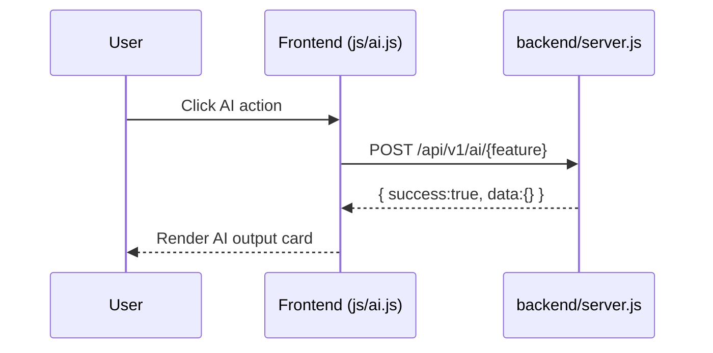

# AI Features (Codex-powered) — Backend Logic and UI Flow

## Features implemented

1. **Explain this topic in simple terms**
   - Endpoint: `POST /api/v1/ai/explain`
   - Input: `topic`, `lessonText`
   - Output: simplified explanation text

2. **Generate interview questions from this lesson**
   - Endpoint: `POST /api/v1/ai/interview-questions`
   - Input: `lessonTitle`, `lessonText`
   - Output: list of interview questions

3. **Create real-world scenario questions**
   - Endpoint: `POST /api/v1/ai/real-world-scenarios`
   - Input: `topic`, `difficulty`
   - Output: list of SRE-style scenario questions

4. **Detect outdated DevOps content**
   - Endpoint: `POST /api/v1/ai/detect-outdated`
   - Input: optional `contentItems[]`
   - Output: `findings[]` with review-required reasons

---

## Backend logic

- Implemented in: `backend/server.js`
- Runtime: Node.js built-in HTTP server (no external dependencies)
- Route model:
  - `GET /api/v1/health`
  - `POST /api/v1/ai/*`
- Includes CORS headers for browser calls.
- Outdated detection heuristics:
  - missing `lastReviewedAt`
  - stale review age threshold (>365 days)
  - known outdated keyword matches

---

## Frontend UI flow

- UI section: `#ai` in `index.html`
- Inputs:
  - topic/lesson title
  - lesson text
  - difficulty selector
- Actions:
  - explain
  - generate interview questions
  - generate scenario questions
  - detect outdated content
- Output:
  - rendered in `#ai-output`

### Flow diagram (ASCII)

```text
User enters topic/lesson -> clicks AI action button
            |
            v
Frontend (js/ai.js) calls js/api.js -> POST /api/v1/ai/*
            |
            v
Backend (backend/server.js) executes Codex-style logic
            |
            v
JSON response -> UI renders explanation/questions/findings
```

### Flow diagram (Mermaid)


