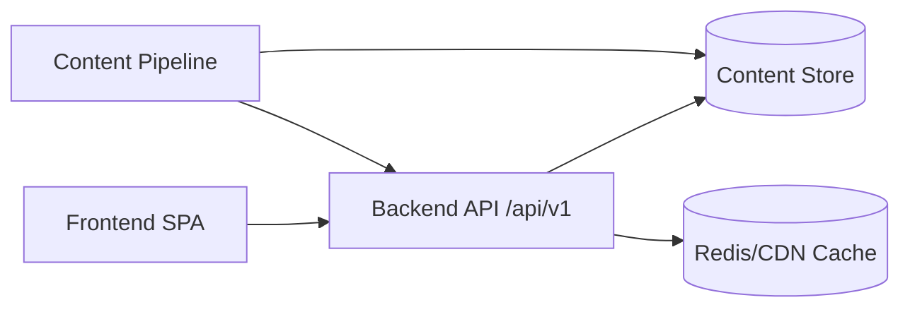
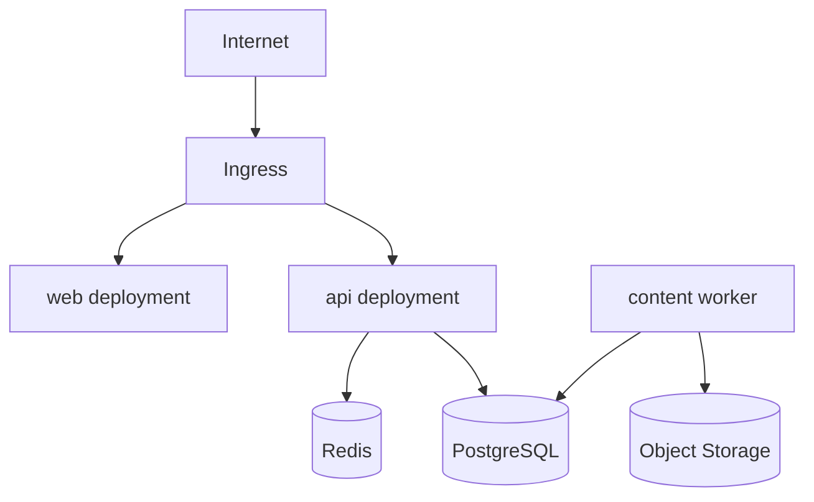

# Backend API Refactor Plan (Conceptual)

This document proposes how to evolve the current static-content model into a backend API-driven architecture with versioned contracts and richer content metadata.

## 1) Why refactor

Current model serves most curated content directly from `data/content.json` in the frontend. For scale and maintainability, move content serving to backend APIs so we can:
- version content centrally,
- add tag/difficulty filtering server-side,
- support rollout strategies (draft/published/deprecated),
- create editor workflows and automated validation.

---

## 2) Target architecture (conceptual)

## ASCII

```text
+----------------------+        +-------------------------------+
| Frontend (Web App)   | -----> | Backend API (versioned /v1)   |
| - UI + filters       |        | - Content query service       |
| - consumes /api/v1   |        | - Tag/difficulty/version filt |
+----------+-----------+        +---------------+---------------+
           |                                    |
           |                                    v
           |                     +-------------------------------+
           |                     | Content Store                 |
           |                     | - PostgreSQL / Document DB    |
           |                     | - Versioned content records   |
           |                     +---------------+---------------+
           |                                     |
           v                                     v
+----------------------+         +-------------------------------+
| CDN / Browser Cache  |         | Content Ingestion Pipeline    |
| (cache API responses)|         | (Git, CMS, AI-assisted input) |
+----------------------+         +-------------------------------+
```

## Mermaid



---

## 3) Versioned API strategy

- Base path: `/api/v1/...`
- Backward-compatible additions are allowed in `v1`.
- Breaking changes require `/api/v2`.
- Content object carries its own semantic content version (`2026.02`, `2026.03`, etc.) independent of API version.

### Example request patterns
- `GET /api/v1/content/modules?tag=kubernetes&difficulty=intermediate&version=2026.02`
- `GET /api/v1/content/labs?topic=docker&labType=break-fix`
- `GET /api/v1/content/interview-questions?role=SRE&difficulty=advanced`

OpenAPI source of truth: `docs/api/openapi.v1.yaml`.

---

## 4) Content domain model changes

Add these fields consistently across modules/labs/questions:

- `tags: string[]` (e.g., `kubernetes`, `incident-response`, `finops`)
- `difficulty: beginner | intermediate | advanced`
- `version: { version, status, publishedAt }`

### Example canonical content envelope

```json
{
  "id": "lab-k8s-breakfix-probes",
  "topic": "kubernetes",
  "title": "Probe Failure Break & Fix",
  "difficulty": "intermediate",
  "tags": ["kubernetes", "sre", "troubleshooting"],
  "version": {
    "version": "2026.02",
    "status": "published",
    "publishedAt": "2026-02-10T09:00:00Z"
  }
}
```

---

## 5) Proposed folder structure changes

> This is a conceptual target structure; migration can be phased.

```text
.
├── apps/
│   ├── web/                        # frontend app
│   │   ├── src/
│   │   └── public/
│   └── api/                        # backend API service
│       ├── src/
│       │   ├── modules/
│       │   │   ├── content/
│       │   │   │   ├── content.controller.ts
│       │   │   │   ├── content.service.ts
│       │   │   │   └── content.repository.ts
│       │   ├── common/
│       │   └── main.ts
│       └── test/
├── packages/
│   ├── contracts/                  # shared API types/schemas
│   │   ├── openapi/
│   │   └── json-schema/
│   └── content-model/              # shared domain model helpers
├── content/
│   ├── source/                     # authored content (md/json/yaml)
│   ├── compiled/                   # validated/normalized content artifacts
│   └── migrations/                 # content schema migrations
├── infra/
│   ├── terraform/
│   └── k8s/
├── docs/
│   ├── ARCHITECTURE.md
│   ├── API_REFACTOR_PLAN.md
│   └── api/
│       └── openapi.v1.yaml
└── .github/workflows/
```

---

## 6) Kubernetes deployment model for API-enabled platform

### Workloads
- `web` deployment (frontend)
- `api` deployment (content API)
- optional `worker` deployment (content compilation/indexing)

### Platform dependencies
- managed DB (RDS/Postgres or Document DB)
- Redis for hot-content caching
- object storage for compiled content bundles

### Mermaid



---

## 7) Content update pipeline (API-first)

1. Author updates content (human/Codex).
2. Validate schema + lint tags/difficulty/version.
3. Compile/normalize content into canonical model.
4. Publish to content store.
5. Invalidate cache + expose via `/api/v1`.
6. Frontend fetches fresh data with ETag/Cache-Control support.

### ASCII

```text
Author/Codex -> PR -> CI validation -> Content compile -> Publish DB -> Cache bust -> API serves v1
```

---

## 8) CI/CD flow with backend + frontend

- **API CI:** unit tests, contract tests, OpenAPI lint, container scan.
- **Web CI:** build + type checks + integration smoke tests.
- **Deploy:** progressive rollout to staging then production.
- **Contract safety:** consumer-driven contract tests to avoid frontend breakage.

---

## 9) Frontend migration plan

### Phase 1 (compatible)
- Keep current UI, add API adapter layer that first attempts `/api/v1`, fallback to local JSON.

### Phase 2
- Move all curated content endpoints to API.
- Keep external live feeds optional via backend proxy (for rate-limit control).

### Phase 3
- Remove static `data/content.json` from runtime path; keep only for seed/migration.

---

## 10) AI (Codex) integration points in new model

- Generate content drafts with required metadata (tags/difficulty/version).
- Run automated schema conformance checks in PR.
- Propose diff-safe API contract updates.
- Create migration scripts for content version transitions.

---

## 11) API contract summary

Authoritative contracts are defined in:
- `docs/api/openapi.v1.yaml`

Core endpoints:
- `GET /api/v1/content/modules`
- `GET /api/v1/content/modules/{moduleId}`
- `GET /api/v1/content/labs`
- `GET /api/v1/content/interview-questions`
- `GET /api/v1/content/tags`

All content is filterable by tags/difficulty/version where applicable.
