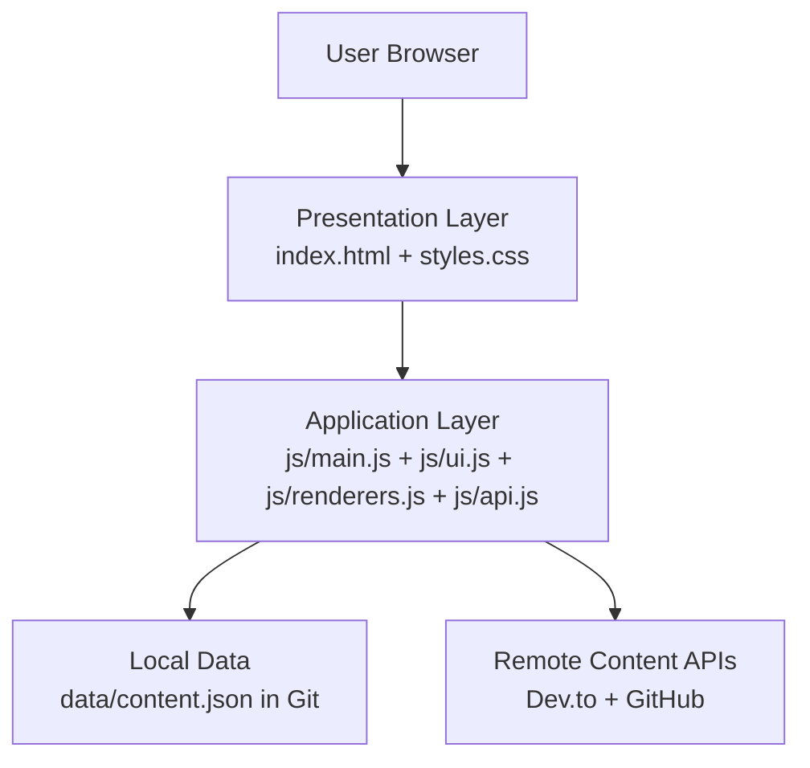
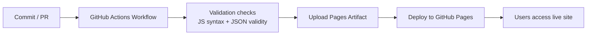
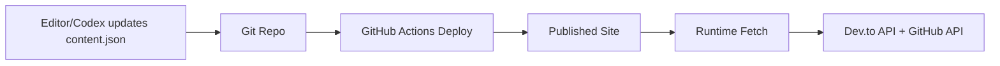
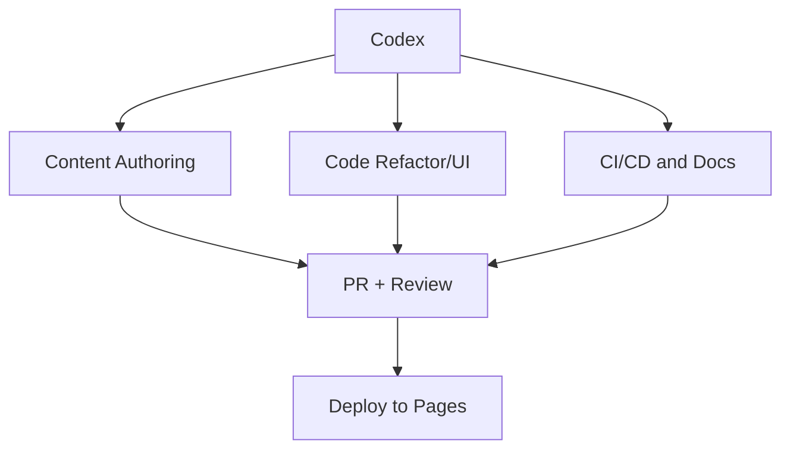

# DevOps Learning Platform — System Architecture

## 1) Goals and Non-Goals

### Goals
- Provide a web learning experience for DevOps topics, interview prep, tool decision guides, and hands-on labs.
- Keep content easy to maintain and frequently update.
- Publish the site online via automated CI/CD.
- Support a contribution workflow where Codex can propose, validate, and ship updates safely.

### Non-Goals
- Not a transactional LMS (no enrollment, payment, graded exam engine).
- Not a multi-tenant backend API platform (current implementation is static-site-first).

---

## 2) High-Level 3-Tier Architecture

Even though the current implementation is static-first, it fits a practical 3-tier model:

- **Presentation tier:** Browser UI (HTML/CSS/JS modules).
- **Application tier:** Client-side orchestration + content rendering + external API integrations.
- **Data tier:** Versioned content in Git (`data/content.json`) plus external content providers (Dev.to, GitHub APIs).

### ASCII Diagram — 3-Tier

```text
+--------------------------------------------------------------+
|                      Presentation Tier                       |
|  Browser (Desktop/Mobile)                                   |
|  - index.html + styles.css                                  |
|  - Interactive menu, labs, interview prep                   |
+-----------------------------+--------------------------------+
                              |
                              v
+--------------------------------------------------------------+
|                      Application Tier                        |
|  Client-side JS Modules                                      |
|  - js/main.js (orchestration)                               |
|  - js/ui.js (menu, interactions)                            |
|  - js/renderers.js (render pipelines)                       |
|  - js/api.js (local+remote fetch abstraction)               |
+----------------------+----------------------+----------------+
                       |                      |
                       v                      v
+--------------------------------+   +-------------------------+
|         Data Tier (Local)      |   |    Data Tier (Remote)   |
|  - data/content.json (Git)     |   | - Dev.to Articles API   |
|  - docs/*.md architecture docs |   | - GitHub Repos Search   |
+--------------------------------+   +-------------------------+
```

### Mermaid Diagram — 3-Tier



---

## 3) Runtime Component Model

### Core frontend components
- **Entry Orchestrator (`js/main.js`)**
  - Bootstraps page.
  - Loads local content model.
  - Coordinates article/project fetch calls.
  - Handles graceful fallbacks.
- **API Adapter (`js/api.js`)**
  - Encapsulates `fetch()` calls.
  - Isolates transport concerns.
- **Renderer Layer (`js/renderers.js`)**
  - Pure-ish rendering for skills/tools/labs/articles/projects.
  - Supports optional fields for advanced labs (Break & Fix fields).
- **UI Interaction Layer (`js/ui.js`)**
  - Menu toggle + section highlighting.
  - Interview question selection/picker.

### Why this modular split matters
- Smaller blast radius for changes.
- Easier testing and code review.
- Better future migration path to SSR/API backend without rewriting all logic.

---

## 4) CI/CD Flow (GitHub Actions + Pages)

Current delivery model uses GitHub Actions and GitHub Pages.

### Pipeline stages
1. **Code change authored** (human or Codex).
2. **Commit/PR created**.
3. **CI checks run** (syntax/json sanity checks in current workflow/process).
4. **Merge to deploy branch** (`main` / `master` / `work` as configured).
5. **Pages deploy workflow** uploads site artifact and publishes.
6. **Users access live URL** (`https://<user>.github.io/<repo>/`).

### ASCII Diagram — CI/CD

```text
Developer/Codex
    |
    v
 Git Commit/PR
    |
    v
 GitHub Actions (Validation + Build Artifact)
    |
    v
 GitHub Pages Deploy Action
    |
    v
 Public Site URL
```

### Mermaid Diagram — CI/CD



---

## 5) Kubernetes Deployment Model (Target Runtime for Labs/Expansion)

> Note: The production website is static-hosted today. Kubernetes model below describes the **target/expansion architecture** and aligns to labs content (AWS + EKS).

### Workload model
- **Namespace strategy:**
  - `platform-system` (shared platform components)
  - `learning-prod` (public app workloads, if containerized version is introduced)
  - `learning-staging` (pre-prod validation)
  - `breakfix-labs-*` (ephemeral lab namespaces)
- **Deployment pattern:**
  - Deployments + Services.
  - Readiness/liveness probes required.
  - Resource requests/limits mandatory.
  - HPA optional where metrics are available.
- **Ingress model:**
  - ALB/NGINX ingress fronting public endpoints.
  - TLS via ACM/Cert-Manager.

### ASCII Diagram — Kubernetes Model

```text
                    +----------------------+
Internet ---------->| Ingress / LoadBalancer|
                    +----------+-----------+
                               |
                 +-------------+-------------+
                 |                           |
         +-------v-------+           +-------v-------+
         | Service: web  |           | Service: api* |
         +-------+-------+           +-------+-------+
                 |                           |
        +--------v---------+         +-------v--------+
        | Deployment: web  |         | Deployment: api|
        | Pods (replicas)  |         | Pods (replicas)|
        +--------+---------+         +-------+--------+
                 |                           |
                 +------------+--------------+
                              v
                     ConfigMap/Secret/PVC

*api is optional for future backend expansion
```

### Mermaid Diagram — Kubernetes Model

```mermaid
flowchart TB
  I[Internet] --> ING[Ingress / LoadBalancer]
  ING --> S1[Service: web]
  ING --> S2[Service: api (future)]
  S1 --> D1[Deployment: web pods]
  S2 --> D2[Deployment: api pods]
  D1 --> C[ConfigMap + Secret]
  D2 --> C
```

### Operational SRE guardrails
- Enforce probe correctness pre-deploy.
- Block `:latest` tags and unsigned images.
- Alert on restart spikes, readiness failures, and 5xx rate.
- Use progressive delivery where possible (canary/blue-green).

---

## 6) Content Update Pipeline

The platform uses a hybrid content model:
- **Curated static content** in `data/content.json` (skills, interview questions, tool guides, labs).
- **Live dynamic content** from external APIs (Dev.to, GitHub).

### Update channels
1. **Editorial/Git updates (source of truth):**
   - Content edits committed to repo.
   - Reviewed via PR.
   - Published through CI/CD.
2. **Runtime live updates:**
   - Browser fetches latest articles/projects on page load.
   - Fallback messages shown if external APIs fail.

### ASCII Diagram — Content Pipeline

```text
Editors/Codex --> data/content.json --> Git Commit --> CI/CD --> Live Site
                                                        |
                                                        v
                                                Browser runtime fetch
                                                (Dev.to + GitHub APIs)
```

### Mermaid Diagram — Content Pipeline



---

## 7) AI (Codex) Integration Points

Codex can integrate at multiple lifecycle points.

### A) Content authoring and enrichment
- Generate/expand learning modules.
- Add real incident narratives.
- Propose interview/break-fix labs.
- Keep consistent schema in `data/content.json`.

### B) Code refactoring and UX enhancements
- Modularization (already applied in JS modules).
- Add UI sections, navigation, and rendering improvements.
- Improve resilience and fallback handling.

### C) DevEx + Delivery automation
- Update workflows (`.github/workflows/*`).
- Draft commit messages and PR descriptions.
- Enforce checklist-driven release quality.

### D) SRE/operations workflows
- Generate runbooks and troubleshooting playbooks.
- Add break/fix scenarios mirroring real incidents.
- Propose observability signals and alert conditions.

### ASCII Diagram — Codex Integration

```text
               +------------------+
               |      Codex       |
               +---------+--------+
                         |
      +------------------+------------------+
      |                  |                  |
      v                  v                  v
 Content Updates    Code Refactors      CI/CD + Docs
 (content.json)     (js/*, ui/ux)       (workflow, runbooks)
      |                  |                  |
      +------------------+------------------+
                         v
                 Git Commit + PR Flow
```

### Mermaid Diagram — Codex Integration



---

## 8) Security Architecture Considerations

### Frontend
- Serve over HTTPS (GitHub Pages default).
- Avoid embedding secrets in client-side code.
- Restrict external data rendering to trusted fields and sanitize if HTML input is ever introduced.

### Supply chain
- Pin action versions in workflows.
- Prefer OIDC over long-lived cloud keys for CI integrations.
- Enforce branch protections and mandatory checks.

### Kubernetes (target model)
- RBAC least privilege.
- Network policies between namespaces.
- Image scanning + admission controls.
- Secret management via external secret providers/KMS.

---

## 9) Scalability and Reliability Notes

- **Current static model** scales well globally via CDN-backed hosting.
- **API dependency risk:** external content sources can rate-limit/fail; UI must degrade gracefully.
- **Future backend scale:** add API tier + cache (Redis/CDN edge cache) before introducing personalized features.
- **Reliability baseline:**
  - SLO example: 99.9% site availability.
  - Error budget guides release velocity.

---

## 10) Deployment Environments (Recommended)

- **Local:** `python3 -m http.server 8000` for static testing.
- **Staging:** GitHub Pages preview branch or separate repo/environment.
- **Production:** GitHub Pages deploy branch via workflow.
- **Lab clusters:** ephemeral EKS namespaces created/destroyed per exercise.

---

## 11) Future Architecture Roadmap

1. Introduce backend API for user progress/bookmarks.
2. Add auth (OIDC) and profile-level learning tracks.
3. Add event-driven content ingestion pipeline (scheduled ETL for external feeds).
4. Add observability stack for platform metrics (frontend RUM + backend metrics/logs).
5. Add policy checks for content schema validation in CI.

---

## 12) Quick Reference

- **UI entrypoint:** `js/main.js`
- **Data source:** `data/content.json`
- **Deploy workflow:** `.github/workflows/deploy-pages.yml`
- **Architecture doc:** `docs/ARCHITECTURE.md`


## 13) API-First Refactor Reference

A conceptual migration plan for backend-served learning content, versioned APIs, and richer content metadata is documented in:

- `docs/API_REFACTOR_PLAN.md`
- `docs/api/openapi.v1.yaml`

This includes proposed API contracts and target folder structure changes.


## 14) AI feature implementation details

- `backend/server.js` (backend AI endpoints)
- `js/ai.js` (frontend AI flow orchestration)
- `docs/AI_FEATURES.md` (feature contracts + UI flow diagrams)
